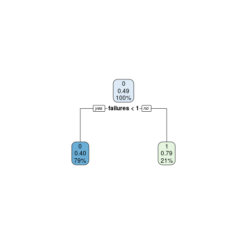
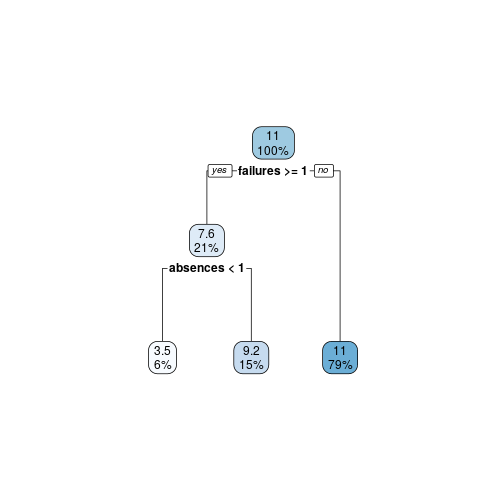
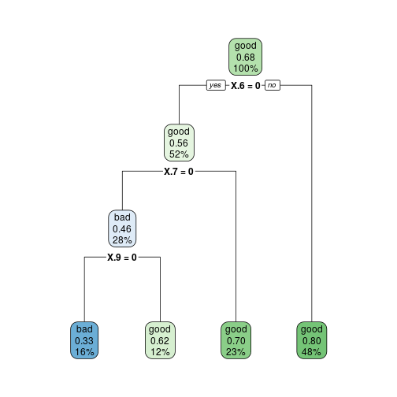
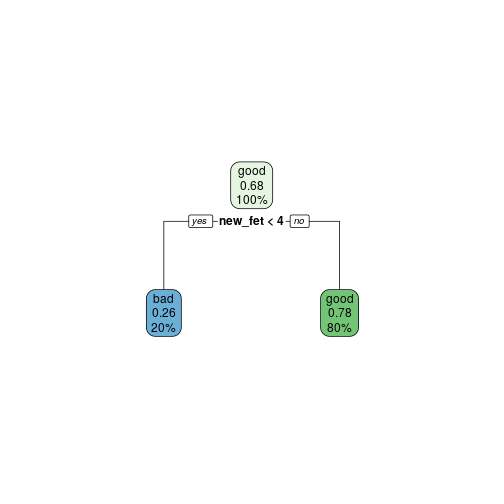

# 1


```r
library('caret')
return_probs <- function(row){
row <- as.numeric(row)

product_1 <- p_v1_v11[,1][row[1]+1]* p_v2_v11[,1][row[2]+1]* p_v3_v11[,1][row[3]+1]* p_v4_v11[,1][row[4]+1]*p_v5_v11[,1][row[5]+1]*p_v6_v11[,1][row[6]+1]*p_v7_v11[,1][row[7]+1]*p_v8_v11[,1][row[8]+1]*p_v9_v11[,1][row[9]+1]*p_v10_v11[,1][row[10]+1]
product_2 <- p_v1_v11[,2][row[1]+1]* p_v2_v11[,2][row[2]+1]* p_v3_v11[,2][row[3]+1]* p_v4_v11[,2][row[4]+1]*p_v5_v11[,2][row[5]+1]*p_v6_v11[,2][row[6]+1]*p_v7_v11[,2][row[7]+1]*p_v8_v11[,2][row[8]+1]*p_v9_v11[,2][row[9]+1]*p_v10_v11[,2][row[10]+1]
product_3 <- p_v1_v11[,3][row[1]+1]* p_v2_v11[,3][row[2]+1]* p_v3_v11[,3][row[3]+1]* p_v4_v11[,3][row[4]+1]*p_v5_v11[,3][row[5]+1]*p_v6_v11[,3][row[6]+1]*p_v7_v11[,3][row[7]+1]*p_v8_v11[,3][row[8]+1]*p_v9_v11[,3][row[9]+1]*p_v10_v11[,3][row[10]+1]

c(P_1*product_1, P_2*product_2, P_3*product_3)

}

binary_data <- read.csv('naive_bayes_binary.csv')
binary_data_train <- binary_data[1:(length(binary_data$V1)/2),]
binary_data_test <- binary_data[2501:5000,]
true_values <- binary_data_test$V11
binary_data_test <- binary_data_test[1:10]

length(binary_data_train$V1)
```

```
## [1] 2500
```

```r
#create tables of all variables and derive their conditional probs

table_v1_v11 <- table(binary_data_train$V1, binary_data_train$V11)
table_v2_v11 <- table(binary_data_train$V2, binary_data_train$V11)
table_v3_v11 <- table(binary_data_train$V3, binary_data_train$V11)
table_v4_v11 <- table(binary_data_train$V4, binary_data_train$V11)
table_v5_v11 <- table(binary_data_train$V5, binary_data_train$V11)
table_v6_v11 <- table(binary_data_train$V6, binary_data_train$V11)
table_v7_v11 <- table(binary_data_train$V7, binary_data_train$V11)
table_v8_v11 <- table(binary_data_train$V8, binary_data_train$V11)
table_v9_v11 <- table(binary_data_train$V9, binary_data_train$V11)
table_v10_v11 <- table(binary_data_train$V10, binary_data_train$V11)

# table_vecs <- 

p_v1_v11 <- prop.table(table_v1_v11,2)
p_v2_v11 <- prop.table(table_v2_v11,2)
p_v3_v11 <- prop.table(table_v3_v11,2)
p_v4_v11 <- prop.table(table_v4_v11,2)
p_v5_v11 <- prop.table(table_v5_v11,2)
p_v6_v11 <- prop.table(table_v6_v11,2)
p_v7_v11 <- prop.table(table_v7_v11,2)
p_v8_v11 <- prop.table(table_v8_v11,2)
p_v9_v11 <- prop.table(table_v9_v11,2)
p_v10_v11 <- prop.table(table_v10_v11,2)


number_1 <- sum(binary_data_train$V11 ==1)
number_2 <- sum(binary_data_train$V11 ==2)
number_3 <- sum(binary_data_train$V11 ==3)

P_1 <- number_1/length(binary_data_train$V11)
P_2 <- number_2/length(binary_data_train$V11)
P_3 <- number_3/length(binary_data_train$V11)

probs_v11_numbers <- c(P_1, P_2, P_3)

results <- c()
for (i in 1:length(binary_data_test$V1)) {
    temp <- return_probs(binary_data_test[i,])
    results <- c(results, match(max(temp), temp))
}

# preds <- return_probs(binary_data[1,])

mean(results == true_values)
```

```
## [1] 0.9424
```

```r
confusion <- table(results, true_values)
confusion
```

```
##        true_values
## results    1    2    3
##       1  177   16    6
##       2   23  206   13
##       3   55   31 1973
```

# 2

## a)


```r
library('rpart')
library('rpart.plot')
student_data <- read.csv('student/student-mat.csv', sep=';')

student_data$class <- ifelse(student_data$G3 > 10,0,1)
new_dat <- student_data[1:30] 
new_dat <- cbind(new_dat, student_data[34])

sample_ind <- sample(nrow(new_dat),nrow(new_dat)*0.70)
train <- new_dat[sample_ind,]
test <- new_dat[-sample_ind,]

set.seed(100)
fit <- rpart(formula = class~., data = train, method = "class", control = rpart.control(cp = -1))

printcp(fit)
```

```
## 
## Classification tree:
## rpart(formula = class ~ ., data = train, method = "class", control = rpart.control(cp = -1))
## 
## Variables actually used in tree construction:
##  [1] age       Dalc      failures  famrel    famsize   Fedu      Fjob     
##  [8] freetime  goout     guardian  health    Mjob      reason    schoolsup
## [15] Walc     
## 
## Root node error: 134/276 = 0.48551
## 
## n= 276 
## 
##           CP nsplit rel error  xerror     xstd
## 1  0.2537313      0   1.00000 1.08209 0.061910
## 2  0.0373134      1   0.74627 0.84328 0.060964
## 3  0.0223881      6   0.53731 0.94030 0.061755
## 4  0.0186567      7   0.51493 0.90299 0.061518
## 5  0.0111940      9   0.47761 0.88806 0.061399
## 6  0.0099502     13   0.41791 0.89552 0.061460
## 7  0.0074627     16   0.38806 0.89552 0.061460
## 8  0.0000000     18   0.37313 0.91791 0.061622
## 9 -1.0000000     23   0.37313 0.91791 0.061622
```

```r
test$pred <- predict(fit, test, type = "class")

#pruning
fit_pruned <- prune(fit, cp = 0.038)
test$pred <- predict(fit_pruned, test, type = "class")

rpart.plot(fit_pruned)
```




## b)

training error = root node error X relative error 

training error = 0.47 * 0.59

generalisation error = 0.47 * 0.84 


## c)

```r
imortant <- fit_pruned$variable.importance

imortant
```

```
##   failures        age   guardian     higher   absences 
## 13.8954468  2.3957667  0.7187300  0.7187300  0.4791533
```
According to the given output 'failures' is the most important variable.


## d)


```r
student_data_reg <- read.csv('student/student-mat.csv', sep=';')
new_dat <- student_data[1:30] 
new_dat <- cbind(new_dat, student_data[33])

sample_ind <- sample(nrow(new_dat), nrow(new_dat)*0.70)
train_reg <- new_dat[sample_ind,]
test_reg <- new_dat[-sample_ind,]

set.seed(100)
fit_reg <- rpart(formula = G3~., data = train_reg, method = "anova", control = rpart.control(cp = -1))

printcp(fit_reg)
```

```
## 
## Regression tree:
## rpart(formula = G3 ~ ., data = train_reg, method = "anova", control = rpart.control(cp = -1))
## 
## Variables actually used in tree construction:
##  [1] absences   activities age        failures   famrel     Fedu      
##  [7] Fjob       freetime   goout      Medu       Mjob       reason    
## [13] sex        studytime  Walc      
## 
## Root node error: 5280.8/276 = 19.133
## 
## n= 276 
## 
##            CP nsplit rel error  xerror     xstd
## 1   0.1235880      0   1.00000 1.00392 0.097113
## 2   0.0762291      1   0.87641 0.90362 0.090044
## 3   0.0258000      2   0.80018 0.81242 0.086316
## 4   0.0234981      4   0.74858 0.91164 0.095049
## 5   0.0192030      7   0.67809 0.90836 0.096999
## 6   0.0153929      8   0.65889 0.89376 0.096556
## 7   0.0115373      9   0.64349 0.90927 0.097631
## 8   0.0112641     10   0.63196 0.90675 0.095669
## 9   0.0101256     11   0.62069 0.90681 0.095764
## 10  0.0094987     12   0.61057 0.90961 0.095318
## 11  0.0088311     13   0.60107 0.92750 0.097520
## 12  0.0087288     14   0.59224 0.93772 0.099166
## 13  0.0084118     15   0.58351 0.93772 0.099166
## 14  0.0074126     16   0.57510 0.95692 0.100647
## 15  0.0072139     18   0.56027 0.95571 0.099703
## 16  0.0068942     19   0.55306 0.95707 0.099689
## 17  0.0056967     20   0.54616 0.95704 0.099669
## 18  0.0055199     21   0.54047 0.95549 0.099844
## 19 -1.0000000     22   0.53495 0.95549 0.099844
```

```r
fit_pruned_reg <- prune(fit_reg, cp = 0.027)

rpart.plot(fit_pruned_reg)
```


training error = root node error X relative error 

training error = 19.33 * 0.8 = 15.65

generalisation error = 19.33 * 0.81 = 15.6573


```r
important2 <- fit_pruned_reg$variable.importance
important2
```

```
##   failures   absences        age   guardian traveltime     higher 
##  652.64610  402.55244  176.98877  110.61798   47.35911   44.24719 
##      goout 
##   23.67956
```

Here too 'failures' is the most important variable.

# 4

### a)

```r
strange_data <- read.csv('strange_binary.csv')

set.seed(100)
fit_strange <- rpart(c~., data=strange_data, method='class', control = rpart.control(cp = 0))

printcp(fit_strange)
```

```
## 
## Classification tree:
## rpart(formula = c ~ ., data = strange_data, method = "class", 
##     control = rpart.control(cp = 0))
## 
## Variables actually used in tree construction:
## [1] X   X.1 X.2 X.3 X.4 X.6 X.7 X.9
## 
## Root node error: 64/200 = 0.32
## 
## n= 200 
## 
##          CP nsplit rel error xerror    xstd
## 1 0.0572917      0   1.00000 1.0000 0.10308
## 2 0.0312500      3   0.82812 1.0938 0.10540
## 3 0.0156250      4   0.79688 1.1094 0.10574
## 4 0.0078125      5   0.78125 1.1094 0.10574
## 5 0.0000000      9   0.75000 1.0781 0.10504
```

```r
#          CP nsplit rel error xerror    xstd
# 1 0.0572917      0   1.00000 1.0000 0.10308
# 2 0.0312500      3   0.82812 1.0938 0.10540
# 3 0.0156250      4   0.79688 1.1094 0.10574
# 4 0.0078125      5   0.78125 1.1094 0.10574
# 5 0.0000000      9   0.75000 1.0781 0.10504

fit_pruned_strange <- prune(fit_strange, cp = 0.031250)
strange_predict <- predict(fit_pruned_strange, strange_data, type='class')
score <- mean(strange_predict == strange_data$c)
rpart.plot(fit_pruned_strange)
```



```r
#cp should be 0.00781
#root node error = 0.32
#rel error = 0.828
#xerror = 1.093
```
Here

Training error = root node error X relative error 

Training error = 0.32 * 0.828

Generalisation error = root node error X xerror

Generalisation error = 0.32 * 1.093

It is not reasonable to assume error rate on generalised data set will be similar to error rate on test set.
Even if the relative error is low, xerror is quite high on this tree. So for test data, the error will be 
higher. 


## b)

```r
new_feature <- rowSums(strange_data[1:10])
strange_data$new_fet <- new_feature

set.seed(100)
fit_strange_new <- rpart(c~., data=strange_data, method='class', control = rpart.control(cp = 0))
printcp(fit_strange_new)
```

```
## 
## Classification tree:
## rpart(formula = c ~ ., data = strange_data, method = "class", 
##     control = rpart.control(cp = 0))
## 
## Variables actually used in tree construction:
## [1] new_fet X       X.1     X.5     X.9    
## 
## Root node error: 64/200 = 0.32
## 
## n= 200 
## 
##         CP nsplit rel error  xerror     xstd
## 1 0.296875      0   1.00000 1.00000 0.103078
## 2 0.009375      1   0.70312 0.70312 0.092274
## 3 0.000000      6   0.65625 0.81250 0.096925
```

```r
fit_pruned_strange_new <- prune(fit_strange_new, cp = 0.009375)
printcp(fit_pruned_strange_new)
```

```
## 
## Classification tree:
## rpart(formula = c ~ ., data = strange_data, method = "class", 
##     control = rpart.control(cp = 0))
## 
## Variables actually used in tree construction:
## [1] new_fet
## 
## Root node error: 64/200 = 0.32
## 
## n= 200 
## 
##         CP nsplit rel error  xerror     xstd
## 1 0.296875      0   1.00000 1.00000 0.103078
## 2 0.009375      1   0.70312 0.70312 0.092274
```

```r
rpart.plot(fit_pruned_strange_new)
```



```r
#0.32 = root node error
#rel error = 0.703
#xerror = 0.703
```

Training error = root node error X relative error 

Training error = 0.32 * 0.703 = 0.20

Generalisation error = 0.32 * 0.703

correct on trainings = 1 - training error  = 1- 0.22496 = 0.77504

# 6


```r
classification_data <- read.csv('classification_accuracy.csv')

wins_decision_tree <- sum(classification_data$decision_tree > classification_data$svm) + sum(classification_data$decision_tree>classification_data$naive_bayes)
wins_svm <- sum(classification_data$svm > classification_data$decision_tree) + sum(classification_data$svm>classification_data$naive_bayes)
wins_naive_bayes <- sum(classification_data$naive_bayes > classification_data$svm) + sum(classification_data$naive_bayes>classification_data$decision_tree)

loss_decision_tree <- sum(classification_data$decision_tree < classification_data$svm) + sum(classification_data$decision_tree<classification_data$naive_bayes)
loss_svm <- sum(classification_data$svm < classification_data$decision_tree) + sum(classification_data$svm<classification_data$naive_bayes)
loss_naive_bayes <- sum(classification_data$naive_bayes < classification_data$svm) + sum(classification_data$naive_bayes<classification_data$decision_tree)

draw_decision_tree <- sum(classification_data$decision_tree == classification_data$svm) + sum(classification_data$decision_tree==classification_data$naive_bayes)
draw_svm <- sum(classification_data$svm == classification_data$decision_tree) + sum(classification_data$svm==classification_data$naive_bayes)
draw_naive_bayes <- sum(classification_data$naive_bayes == classification_data$svm) + sum(classification_data$naive_bayes==classification_data$decision_tree)

a <- c(wins_decision_tree, draw_decision_tree, loss_decision_tree)
b <- c(wins_naive_bayes, draw_naive_bayes, loss_naive_bayes)
c <- c(wins_svm, draw_svm, loss_svm)

k <- rbind(a,b,c)
rownames(k) = c('Decision_tree', 'Naive_bayes', 'SVM')
colnames(k) = c('Wins','Draw','Losses')

confusion_matrix <- k

confusion_matrix
```

```
##               Wins Draw Losses
## Decision_tree   19    1     26
## Naive_bayes     14    1     31
## SVM             35    0     11
```
