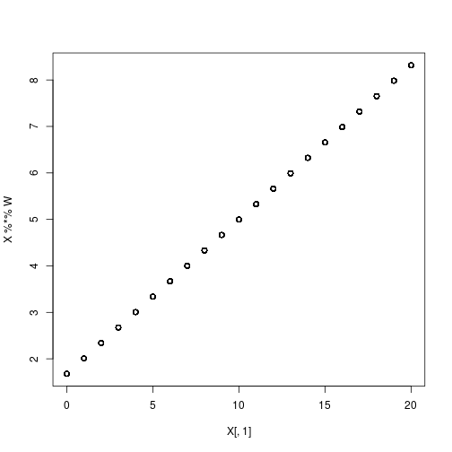
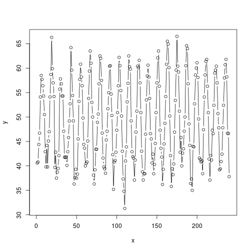
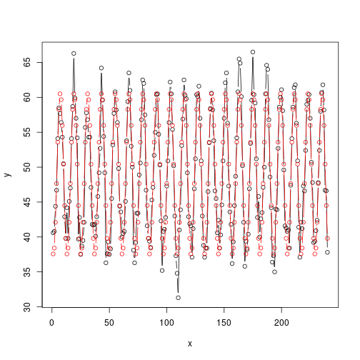
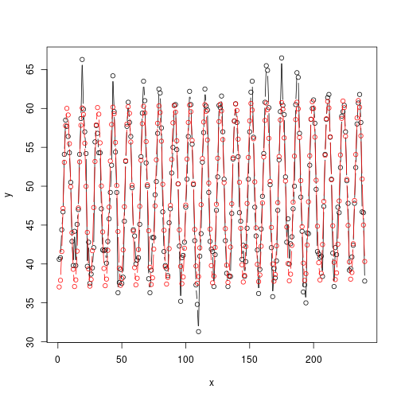
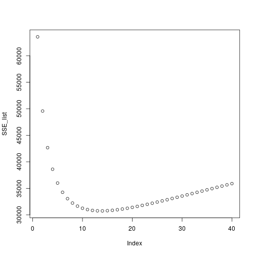

# 1

## a

```r
data <- read.csv('Vocab.csv')

X <- cbind(data$education, rep(1, length(data$education))) 
Y <- data$vocabulary #scores
#X t Xw = X t y
```

## b

```r
xtx <- t(X) %*% X
xty <- t(X) %*% Y

W <- solve(xtx) %*% xty
a <- W[1]
b <- W[2]
a
```

```
## [1] 0.3318736
```

```r
b
```

```
## [1] 1.677939
```

## c

```r
k <- X%*%W

plot(X[,1], X%*%W)
```


as observed from the plot, people with more education do tend to have larger vocabularies.

# d


```r
change_in_marks  <- 1 * W[1]
change_in_marks
```

```
## [1] 0.3318736
```
With unit increase in year of education, there will be 0.33 increase in voculabulary score.


# 2
## a

```r
aus_data <- read.csv("ais.csv",stringsAsFactors=FALSE, sep=",")

Y <- aus_data$rcc
X <- aus_data[,3:12]

xtx <- t(X) %*% as.matrix(X)
xty <- t(X) %*% Y

W <- solve(xtx) %*% xty
W
```

```
##                 [,1]
## wcc     1.112919e-03
## hc      1.046425e-01
## hg      3.290207e-02
## ferr    3.440278e-05
## bmi    -1.272889e-02
## ssf     3.441954e-03
## pcBfat -9.056660e-03
## lbm     9.588279e-03
## ht     -1.281386e-03
## wt     -6.595720e-03
```

## b


```r
y_pred <- as.matrix(X) %*% W

error <- (Y - y_pred)
error_square <- error^2
sum_error <- sum(error_square)
sum_error
```

```
## [1] 5.909294
```

## c


```r
lis_errors <- c()
for(i in 1:ncol(X)){
    new_data <- X
    new_data <- new_data[-i] 

    W <- solve(t(new_data) %*% as.matrix(new_data)) %*% (t(new_data) %*% Y)
    y_pred <- as.matrix(new_data) %*% W

    error <- (Y - y_pred)
    error_square <- error^2
    sum_error <- sum(error_square)
    print(sum_error)
    lis_errors <- c(lis_errors, sum_error)
}
```

```
## [1] 5.910028
## [1] 8.518492
## [1] 5.942013
## [1] 5.909733
## [1] 5.961539
## [1] 6.021431
## [1] 5.919325
## [1] 5.916463
## [1] 5.927754
## [1] 5.914183
```

```r
print(lis_errors)
```

```
##  [1] 5.910028 8.518492 5.942013 5.909733 5.961539 6.021431 5.919325
##  [8] 5.916463 5.927754 5.914183
```
Variable ‘hc’ ommision causes the greatest increase in sse. Thus 'hc' is the most important variable.

# 3

## a

```r
data(nottem)
y <- nottem
n <- length(y)
x <- 1:n

plot(x,y,type="b")
```



## b

```r
x_cos <- cos((2*pi*x)/12)
x_sin <- sin((2*pi*x)/12)
for_c <- rep(1,n)

sine.cosine.x <- cbind(x_cos, x_sin, for_c)

w <- solve(t(sine.cosine.x) %*% sine.cosine.x) %*% (t(sine.cosine.x) %*% y)
w
```

```
##            [,1]
## x_cos -9.240921
## x_sin -6.940906
## for_c 49.039583
```

```r
y_pred <- sine.cosine.x %*% w

plot(x,y,type="b")
lines(x,y_pred,type="b",col="red")
```



## c


```r
sine.cosine.x_new <- cbind(sine.cosine.x, x)
w_new <- solve(t(sine.cosine.x_new) %*% as.matrix(sine.cosine.x_new)) %*% (t(sine.cosine.x_new) %*% y)
y_pred_d <- sine.cosine.x_new %*% w_new

plot(x,y,type="b")
lines(y_pred_d, type = 'b',col='red')
```


As observd form the plot, it can be seen that the sales have increased slightly. 
Also, the coeficients are positive for x.

# 4

## a


```r
X1 <- read.table("pred1.dat")
Y1 <- read.table('resp1.dat')

X1_1 <- X1[1:nrow(X1)/2, ]
Y1_1 <- Y1[1:nrow(X1)/2, ]
W1 <- solve(t(X1_1) %*% as.matrix(X1_1)) %*% (t(X1_1) %*% Y1_1)
W1
```

```
##              [,1]
## V1  -0.0001462392
## V2   0.0023673550
## V3  -0.0103495992
## V4  -0.0038157749
## V5   0.0064704464
## V6  -0.0030364833
## V7   0.0083078788
## V8   0.0041337085
## V9  -0.0001638410
## V10  0.0038802311
## V11 -0.0052698373
## V12  0.0038945894
## V13 -0.0011272330
## V14  0.0024793628
## V15 -0.0040745922
## V16 -2.9974777796
## V17  0.0028539967
## V18 -0.0047552059
## V19  0.0013206278
## V20  0.0016268581
## V21 10.0006846031
## V22  0.0049659815
## V23  0.0042485128
## V24  0.0046442982
## V25 -0.0047082976
## V26 -0.0019849426
## V27  0.0077868315
## V28 -0.0002345588
## V29 -0.0031292443
## V30  0.0083918864
## V31 -0.0007431051
## V32 -0.0118349438
## V33  0.0054164934
## V34 -0.0042963048
## V35 -0.0014327468
## V36 -0.0038093780
## V37  0.0023755562
## V38 -0.0027754490
## V39  0.0023261870
## V40  0.0012325474
## V41 -0.0025748760
## V42  0.0047146853
## V43 -0.0006890427
## V44  0.0045375411
## V45  0.0037673560
## V46  0.0038160399
## V47  4.9972624125
## V48  0.0036386886
## V49 -0.0078756874
## V50  0.0016951290
```

```r
X2 <- read.table("pred2.dat")
Y2 <- read.table('resp2.dat')

X2_1 <- X2[1:nrow(X2)/2, ]
Y2_1 <- Y2[1:nrow(X2)/2, ]
W2 <- solve(t(X2_1) %*% as.matrix(X2_1)) %*% (t(X2_1) %*% Y2_1)
W2
```

```
##              [,1]
## V1    10.90739810
## V2   -30.27403868
## V3    21.93560645
## V4    -4.28957288
## V5     7.84720442
## V6    10.20155807
## V7   -20.12190301
## V8    -2.85715860
## V9     9.34188424
## V10  -25.18681608
## V11    8.59363245
## V12  -18.68309085
## V13   -9.64635252
## V14    5.46811679
## V15   13.72070914
## V16   20.06464419
## V17   -8.83395654
## V18    4.73872502
## V19   -3.61601614
## V20   -4.78403063
## V21   -4.77130486
## V22  -20.50199289
## V23   27.31445241
## V24    0.36499886
## V25    5.13917748
## V26   -4.52897374
## V27   -2.29204041
## V28  -12.11356718
## V29  -17.95829473
## V30   -0.32911195
## V31   -9.70094972
## V32   -5.28577219
## V33   21.18217261
## V34  -18.77152554
## V35   12.90975101
## V36    3.40124088
## V37  -19.49552173
## V38  -17.84471555
## V39   -9.36031883
## V40   11.40579874
## V41    0.25657045
## V42   -7.12667828
## V43   17.56888378
## V44   -0.77321587
## V45   12.18878455
## V46    8.12801031
## V47   -6.67286627
## V48   -9.91292052
## V49   15.83889825
## V50    5.21562771
## V51    6.24882579
## V52   -9.79070960
## V53   -9.16312209
## V54  -23.34539500
## V55    3.42039505
## V56  -11.41000869
## V57   25.98515166
## V58    2.25640680
## V59    3.83827712
## V60  -12.63025944
## V61  -14.18214791
## V62    3.18614808
## V63    0.41994018
## V64   10.50244739
## V65   -3.70638281
## V66   16.82186312
## V67  -11.14373712
## V68    0.01437147
## V69    4.81792526
## V70   16.89008185
## V71   -8.39891094
## V72    0.85731853
## V73   -8.55724804
## V74   -6.43050556
## V75    6.76253557
## V76    5.44829681
## V77   14.38341039
## V78  -14.55701674
## V79  -10.56293910
## V80    4.04129746
## V81    6.64964591
## V82   11.70630210
## V83   -0.18059933
## V84   21.67505418
## V85   11.81585951
## V86   16.37496046
## V87   23.25763233
## V88  -18.36036837
## V89   -0.67409762
## V90   25.61518081
## V91   15.16094137
## V92    0.68993781
## V93   -9.70150291
## V94    4.98827046
## V95   12.04171047
## V96   11.69067930
## V97   -3.63645822
## V98  -15.30890661
## V99   15.33608222
## V100   1.05364403
## V101  13.00108743
## V102  -0.67967520
## V103 -15.39022082
## V104  -6.17605007
## V105  -0.97105323
## V106   8.80337889
## V107  -9.94534654
## V108  11.32104569
## V109  -0.53891335
## V110   5.36995199
## V111   9.45576382
## V112  24.71778632
## V113  -9.52011239
## V114   3.59691754
## V115   1.84436591
## V116  -4.50937931
## V117   1.44185158
## V118 -10.40389727
## V119  12.73475218
## V120   3.58479427
## V121  -7.37404057
## V122   9.40610715
## V123 -17.56886772
## V124  -6.26004560
## V125  12.59014213
## V126  14.33751286
## V127  22.19235866
## V128   8.87655672
## V129  -3.77696261
## V130   4.55218153
## V131  -3.63947346
## V132 -19.82853929
## V133  14.67832776
## V134   9.91763182
## V135   0.68782246
## V136  -4.23264075
## V137 -18.70424105
## V138  10.01653993
## V139  -8.75719632
## V140   9.34039042
## V141   2.30883668
## V142  -3.06337182
## V143  -2.12724139
## V144  -6.90498676
## V145  -2.37057193
## V146   0.53181836
## V147  -1.90465128
## V148 -14.52251670
## V149  14.64502815
## V150  -6.93854550
## V151  18.40803710
## V152   1.11545992
## V153 -20.89396397
## V154  13.37879205
## V155  18.04254166
## V156  14.01272830
## V157   1.34105715
## V158   9.62988461
## V159  -5.27985610
## V160  -6.53990466
## V161   6.51949269
## V162 -11.43437021
## V163  -2.89160540
## V164  -3.69499047
## V165  -6.35988493
## V166   5.23787312
## V167  -4.96727716
## V168  -1.93996759
## V169  -8.06650640
## V170  -3.28332573
## V171 -15.78039642
## V172   9.96692136
## V173  -1.92771743
## V174 -16.75882813
## V175   3.84458687
## V176  -8.50413586
## V177 -17.18660604
## V178   2.53919867
## V179  17.95502165
## V180  24.64641047
## V181   1.61473022
## V182   2.62031236
## V183  -1.59809068
## V184  -3.99169411
## V185   6.34690447
## V186   7.25824879
## V187   6.85366657
## V188 -21.24378897
## V189  16.00916343
## V190  -5.86383039
## V191   6.32714642
## V192 -10.79146354
## V193 -11.07176334
## V194   1.21749552
## V195   1.18727930
## V196  -3.13676023
## V197  16.01742046
## V198   5.53730820
## V199  14.42076038
## V200   8.09668081
## V201  -1.15397849
## V202  10.64666608
## V203 -19.10603306
## V204  11.42983986
## V205  -2.66617117
## V206  -4.90423552
## V207   3.35684941
## V208  12.32028881
## V209  -3.52519423
## V210 -13.87204628
## V211 -10.63283852
## V212 -18.18539838
## V213   2.03519195
## V214   4.42430318
## V215   1.53021900
## V216   5.05034710
## V217 -11.15832886
## V218  11.77198788
## V219  -8.67666185
## V220   3.17494042
## V221   1.97468867
## V222 -18.69323077
## V223 -14.39909841
## V224  -4.02204836
## V225  -9.54734089
## V226   0.41051888
## V227 -10.58682830
## V228 -15.52804754
## V229   2.56049032
## V230  16.73631332
## V231 -10.66768293
## V232   1.50411321
## V233   2.86324480
## V234   5.64988687
## V235   8.26458818
## V236 -11.86734832
## V237  11.65037204
## V238  -7.98930946
## V239   4.20715077
## V240  11.18752748
## V241  25.07107929
## V242 -19.68816166
## V243  -1.25329326
## V244  -1.27830939
## V245  -4.88760962
## V246  -0.15806890
## V247  10.47110583
## V248 -10.67435167
## V249   5.26470836
## V250   8.54931381
## V251 -13.94984322
## V252   9.95568483
## V253  -4.91340789
## V254  -1.71088707
## V255   8.73764873
## V256  11.90328252
## V257   4.24304252
## V258  -4.80869093
## V259  -9.97317463
## V260  -9.55657900
## V261  -8.44435164
## V262   4.51805454
## V263  -8.23426200
## V264  22.62114344
## V265 -12.72811725
## V266  -6.22553991
## V267  -0.43046759
## V268  -9.18548835
## V269   3.62973687
## V270   2.65891894
## V271   3.54529818
## V272  18.98510702
## V273   2.20899294
## V274   7.76078534
## V275 -11.32754380
## V276  -5.56261478
## V277 -16.47497729
## V278   6.91640558
## V279 -11.54622043
## V280 -15.48702288
## V281  -0.33631507
## V282  14.70113483
## V283 -22.23776568
## V284   1.01018834
## V285  -6.54749136
## V286   0.42430456
## V287   0.17884745
## V288   0.57683359
## V289   3.64088137
## V290  -0.45373813
## V291   3.84290546
## V292   1.16827651
## V293 -10.95444912
## V294  -0.28732044
## V295   2.61339112
## V296   5.54141933
## V297   8.23383722
## V298 -19.26134719
## V299   3.55638218
## V300   3.16473285
## V301  -6.41931706
## V302 -18.55072693
## V303   7.67539417
## V304   7.26798806
## V305 -11.75484527
## V306 -13.93329115
## V307   7.31267133
## V308  -0.61404312
## V309   1.05293944
## V310  -8.67219226
## V311  -3.03346040
## V312   9.26375969
## V313  24.46995318
## V314   0.08222980
## V315   1.35514001
## V316 -13.20321269
## V317   8.28265939
## V318  28.78186958
## V319   4.39512215
## V320 -15.96207563
## V321 -25.47452491
## V322  14.80109835
## V323  11.27876561
## V324  -0.77548478
## V325   5.31493221
## V326  -2.77344754
## V327  -5.00410091
## V328   2.13458205
## V329  -1.77263980
## V330  12.16775164
## V331  -7.07653720
## V332  14.33624449
## V333  16.88267208
## V334   9.61443361
## V335  -4.55424569
## V336  -2.29776740
## V337  -0.37622021
## V338  -4.54476975
## V339   1.97420741
## V340  -6.26633898
## V341   9.93159169
## V342  -1.11633505
## V343 -22.75057253
## V344  14.31558436
## V345   1.11763600
## V346  29.36587971
## V347 -10.72432030
## V348   6.94570871
## V349   3.22187663
## V350   6.22710428
## V351  14.96284728
## V352  -1.20081082
## V353 -15.77756988
## V354  -8.81092658
## V355   3.49878738
## V356  -3.79627174
## V357  -9.54846025
## V358   6.01122540
## V359   2.26747104
## V360 -19.24950818
## V361 -11.38426336
## V362  -5.85304620
## V363  14.20827557
## V364  13.97458140
## V365  -6.02570765
## V366   2.98879225
## V367  -2.30184031
## V368  -7.48987967
## V369  14.05220411
## V370   5.71910379
## V371  -3.52635946
## V372  22.25104721
## V373   2.80920116
## V374   0.92230586
## V375 -29.35423684
## V376   9.00144922
## V377  12.77867948
## V378  -6.41164265
## V379  -1.23612194
## V380  29.14504670
## V381  10.95677756
## V382 -17.56878840
## V383  -0.50800569
## V384  -8.16616525
## V385  -6.23204956
## V386  -2.35117670
## V387  -5.01210648
## V388  -2.84633579
## V389   1.13418508
## V390   1.94191526
## V391  -7.52251294
## V392  -8.89176010
## V393 -15.94538577
## V394   3.74234144
## V395   0.47854164
## V396 -13.96735409
## V397   4.60782559
## V398 -15.06195574
## V399  15.23401727
## V400  12.82988566
## V401 -10.45310517
## V402  19.92497754
## V403  -5.82824763
## V404 -33.07652102
## V405  -1.59740990
## V406   7.33967347
## V407   1.91628281
## V408 -16.78216627
## V409  11.41822831
## V410  -5.75558674
## V411  -7.58977135
## V412  -8.40601600
## V413   6.38783535
## V414 -12.22059574
## V415   6.93586169
## V416 -23.94239376
## V417  -6.45892645
## V418  18.71964169
## V419   6.79807513
## V420   3.47961152
## V421   3.17915866
## V422   7.17520463
## V423 -10.50612382
## V424  -6.63927046
## V425   2.23806015
## V426  -8.74337116
## V427  12.55127113
## V428  -9.63089987
## V429   6.31312102
## V430 -13.42538255
## V431 -14.91591612
## V432   1.97025073
## V433 -23.05346817
## V434   0.49614174
## V435  -5.32032179
## V436 -16.71188941
## V437   4.05279471
## V438   1.01196576
## V439  -2.27504695
## V440  -6.32993344
## V441  13.84032070
## V442   0.22653870
## V443  -6.43403445
## V444  -6.38047275
## V445  -4.73025318
## V446 -18.09848044
## V447   7.69291569
## V448 -16.17209985
## V449   8.72369425
## V450  11.91687965
## V451  16.74366411
## V452 -11.42280610
## V453 -20.18454638
## V454 -23.27338720
## V455   2.60427152
## V456  23.18796361
## V457  12.03903433
## V458   2.35715132
## V459   5.53166768
## V460   2.91945482
## V461   2.31781127
## V462 -10.43569447
## V463  13.94073638
## V464 -14.95308863
## V465 -15.43315032
## V466   4.17468377
## V467  11.05671378
## V468  -1.24538881
## V469   3.54249867
## V470  -8.17266225
## V471   1.86620388
## V472 -12.66764972
## V473   4.57817313
## V474   0.19414683
## V475 -16.74363050
## V476  -2.06353932
## V477 -14.06347304
## V478  25.45618363
## V479  23.90792303
## V480 -25.85372663
## V481  -4.36547684
## V482 -15.14691758
## V483 -17.29082967
## V484   3.14434762
## V485  -3.62518647
## V486 -11.21893585
## V487  -1.23179818
## V488  35.46866323
## V489 -14.14555414
## V490  -5.41755514
## V491   1.81776312
## V492   3.32260180
## V493   5.24846853
## V494   4.51706162
## V495  -1.24558781
## V496   0.49691728
## V497   1.34691156
## V498   4.09909232
## V499  21.34433513
## V500  -3.38213312
```

## b


```r
X1_2 <- X1[(nrow(X1)/2+1):nrow(X1), ]
Y1_2 <- Y1[(nrow(X1)/2+1):nrow(X1), ]
SSE_1 <- sum(((as.matrix(X1_2) %*% as.matrix(W1)) - Y1_2)^2)
SSE_1
```

```
## [1] 5.722528
```

```r
X2_2 <- X2[((nrow(X2)/2) + 1):nrow(X2), ]
Y2_2 <- Y2[((nrow(X2)/2) + 1):nrow(X2), ]
SSE_2 <- sum(((as.matrix(X2_2) %*% as.matrix(W2)) - Y2_2)^2)
SSE_2
```

```
## [1] 32984664
```

# 5

## a


```r
X1 <- read.table("pred1.dat")
Y1 <- read.table('resp1.dat')

X1_1 <- X1[1:(nrow(X1)/2), ]
Y1_1 <- Y1[1:(nrow(X1)/2), ]

X1_2 <- X1[((nrow(X1)/2)+1):nrow(X1), ]
Y1_2 <- Y1[((nrow(X1)/2)+1):nrow(Y1), ]

SSE <- rep(0, ncol(X1_1))
for(elem in 1:length(X1_1)){
    column <- X1_1[,elem]
    W <- solve(t(column) %*% as.matrix(column)) %*% (t(column) %*% Y1_1)
    new <- column %*% W
    SSE_1 <- sum(((as.matrix(column) %*% as.matrix(W)) - Y1_1)^2)
    SSE[elem] <- SSE_1    
}
index_single <- which.min(SSE)
SSE[index_single]
```

```
## [1] 17332.46
```

```r
index_single
```

```
## [1] 21
```

```r
SSE_second <- rep(0, ncol(X1_1))
for(i in 1:ncol(X1_1)){
    if(i == index_single){
        SSE_second[i] = Inf
    }

    else{
        X <- X1_1[,c(i,index_single)]
        w <- solve(t(X) %*% as.matrix(X)) %*% (t(X) %*% Y1_1)
        y_hat <- as.matrix(X) %*% as.matrix(w)
        SSE_ <- sum((y_hat - Y1_1)^2)
        SSE_second[i] <- SSE_    
    }
}
index_single_sec <- which.min(SSE_second)
SSE_second[index_single_sec]
```

```
## [1] 4581.104
```

```r
index_single_sec
```

```
## [1] 47
```

```r
SSE_third <- rep(0, ncol(X1_1))
for(i in 1:ncol(X1_1)){
    if(i == index_single | i == index_single_sec){
        SSE_third[i] = Inf
    }

    else{
        X <- X1_1[,c(i,index_single, index_single_sec)]
        w <- solve(t(X) %*% as.matrix(X)) %*% (t(X) %*% Y1_1)
        y_hat <- as.matrix(X) %*% as.matrix(w)
        SSE_ <- sum((y_hat - Y1_1)^2)
        SSE_third[i] <- SSE_    
    }
}
index_single_third <- which.min(SSE_third)
SSE_third[index_single_third]
```

```
## [1] 5.30266
```

```r
index_single_third
```

```
## [1] 16
```

## b


```r
X_new <- X1_1[,c(index_single, index_single_sec, index_single_third)]
Y_new <- Y1_1

W_new <- solve(t(X_new) %*% as.matrix(X_new)) %*% (t(as.matrix(X_new)) %*% as.matrix(Y_new))
y_hat_new <- as.matrix(X_new) %*% as.matrix(W_new)

SSE_new <- sum((y_hat_new - Y_new)^2)
SSE_new
```

```
## [1] 5.30266
```

```r
W_ll <- solve(t(X1_1) %*% as.matrix(X1_1)) %*% (t(X1_1) %*% Y1_1)
y_all <- as.matrix(X1_1) %*% as.matrix(W_ll)

SSE_all <- sum((y_all - Y1_1)^2)
SSE_all
```

```
## [1] 4.849722
```

# 6

## a


```r
X2 <- read.table("pred2.dat")
Y2 <- read.table('resp2.dat')

X2_1 <- X2[1:nrow(X2)/2, ]
Y2_1 <- Y2[1:nrow(X2)/2, ]

X2_2 <- X2[((nrow(X2)/2) + 1):nrow(X2), ]
Y2_2 <- Y2[((nrow(X2)/2) + 1):nrow(X2), ]
lambda <- 20*diag(length(X2_1))
W2_r <- solve(t(X2_1) %*% as.matrix(X2_1) + lambda) %*% (t(X2_1) %*% Y2_1)
y_hat_r <- as.matrix(X2_2) %*% as.matrix(W2_r)
```

## b


```r
SSE_r <- sum((y_hat_r - Y2_2)^2)
SSE_r
```

```
## [1] 31423.26
```

```r
W2_n <- solve(t(X2_1) %*% as.matrix(X2_1)) %*% (t(X2_1) %*% Y2_1)
y_hat_n <- as.matrix(X2_2) %*% as.matrix(W2_n)
SSE_n <- sum((y_hat_n - Y2_2)^2)
SSE_n
```

```
## [1] 32984664
```

```r
SSE_r
```

```
## [1] 31423.26
```

## c


```r
SSE_list <- c()
for(lambd in 1:40){
    
    # if(! lambd %% 1){
        W <- solve(t(X2_1) %*% as.matrix(X2_1) + lambd*diag(length(X2_1))) %*% (t(X2_1) %*% Y2_1)
        y_hat <- as.matrix(X2_2) %*% as.matrix(W)
        SSE <- sum((y_hat - Y2_2)^2)
        # print(lambd)
        # print(SSE)
        SSE_list <- c( SSE_list,SSE)
    # }

}
length(SSE_list)
```

```
## [1] 40
```

```r
plot(SSE_list)
```



# 7


```r
data <- read.table("time_series.dat")
n <- nrow(data)
fet1 <- data[1:(n-2),]
fet2 <- data[2:(n-1),]
Y <- data[3:n,]

X <- cbind(fet1, fet2)

w <- solve(t(X) %*% as.matrix(X)) %*% (t(X) %*% Y)
y_pred <- X %*% w

diff <- y_pred - Y
mean(Y - X %*% w)
```

```
## [1] 0.0001025655
```

```r
var(Y - X %*% w)
```

```
##             [,1]
## [1,] 0.002502056
```
