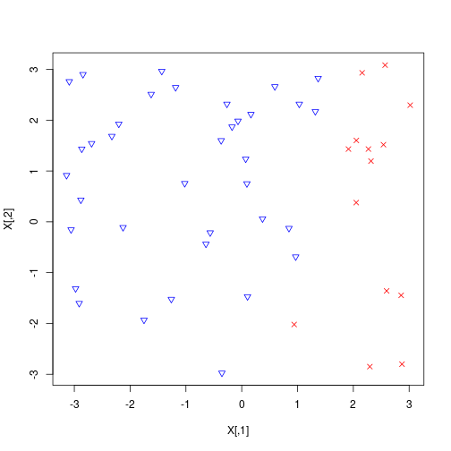
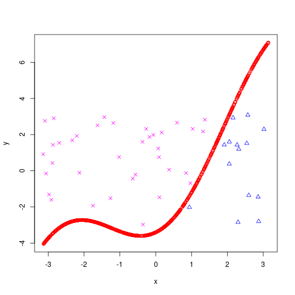
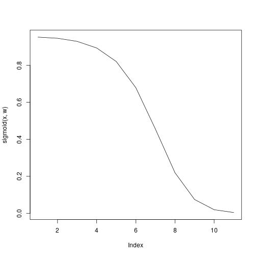
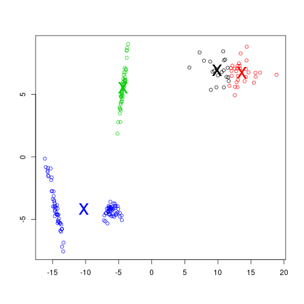

# 2

# a


```r
library(quadprog)

N <- 50
X <- matrix(0,nrow = N, ncol = 2);
W <- rnorm(5)
C <- matrix(0, nrow=N, ncol=1)
data <- matrix(0, nrow=N, ncol=5)
A <- matrix(0, nrow=N, ncol=5)

for(i in 1:N){
    X[i,] = runif(2, -pi, pi)
    data[i,][1] = 1
    data[i,][2] = X[i,][1]
    data[i,][3] = X[i,][2]
    data[i,][4] = cos(X[i,][1])
    data[i,][5] = sin(X[i,][1])

    C[i] <- sign(t(W) %*% data[i,])
    A[i,] <- C[i,]*data[i,]
}

plot(X, pch=(C+5), col=(C+3))
```



# b


```r
data <- as.matrix(data)

Q <- diag(5)
Q[5,5] <- 0.01
q <- rep(0, 5)
b <- rep(1, N)
result <- solve.QP(Q,q,t(A),b)

What <- result$solution
x <- runif(1000, -pi, pi)
y <- -(What[1] + What[2]*x + What[4]*cos(x) + What[5]*sin(x))/What[3]
plot(x,y, col='red')
lines(X, pch=C+3, type='p', col=(C+5))
```



# 3

# a


```r
x <- c(0:10)
w0 <- 3
w1 <- -0.05
w2 <- -0.08
#a
w <- cbind(w0, w1, w2)
sigmoid <- function(x, w){
    1/(1+exp(-(w[1] + w[2]*x + w[3]*x^2)))
}
plot(sigmoid(x, w), type='l')
```



#b


```r
dat_chipotle <- read.table('chipotle.dat')

dat_chipotle <- dat_chipotle[1:500,]
fet_dat <- cbind(rep(1, 500), dat_chipotle$V1, (dat_chipotle$V1)^2)
Y <- dat_chipotle$V2
#---------------------------------
learning_rate <- 0.001
#--------------------------------
w <- c(w0, w1, w2)
count <- 100

while(count > 0 ){
    count <- count - 1
    for(i in 1:500){
        # print(w)
        # print(Y[i] - sigmoid(dat_chipotle$V1[i], w))
        w[1] <- w[1] + learning_rate*(Y[i] - sigmoid(dat_chipotle$V1[i], w))
        w[2] <- w[2] + learning_rate*(Y[i] - sigmoid(dat_chipotle$V1[i], w))*dat_chipotle$V1[i]
        w[3] <- w[3] + learning_rate*(Y[i] - sigmoid(dat_chipotle$V1[i], w))*(dat_chipotle$V1[i])^2
        # print(w)
    }
}
print(w)
```

```
## [1]  2.81129757  0.29512871 -0.09981082
```

```r
# View(sigmoid(dat_chipotle$V1, w))
# View(dat_chipotle$V2)

p <- sigmoid(dat_chipotle$V1, w)
logit <- ifelse(p > 0.5,1 ,0)
# class1 = df[,4]

# View(logit)
# View(Y)

sum(logit == Y)/length(logit)
```

```
## [1] 0.814
```

# c


```r
set.seed(100)
w1 = rep(0,3)

X <- cbind(rep(1,500),dat_chipotle$V1, (dat_chipotle$V1)^2)
# Newton ralphson method to optmize w
for (i in 1:1000) { 
  p1 = 1/(1+exp(-t(w1) %*% t(X)))
  p1 = as.vector(p1)
  D = diag(p1*(1-p1))
  H = -t(X) %*% D %*% X
  grad1 = t(X) %*% (Y - p1)
  w1 = w1 - solve(H)%*%grad1
#   print(w1)
} 

print(w1)
```

```
##            [,1]
## [1,]  2.2067068
## [2,]  0.3801537
## [3,] -0.1259208
```

# 5

# a


```r
give_labels <- function(clus, centers){
    d <- c()
    labels <- c()
    for(i in 1:200){
        d1 <- dist(clus[i,], centers[1,])
        d2 <- dist(clus[i,], centers[2,])
        d3 <- dist(clus[i,], centers[3,])
        d4 <- dist(clus[i,], centers[4,])
    # d < c(, dist(clus[i,], c[2,]), dist(clus[i,], c[3,]), dist(clus[i,], c[4,]))
        d <- c(d1, d2, d3, d4)
        labels <- c(labels, which(d == min(d)))
        d <- c()
    }
    clus <- cbind(clus, labels)
    # View(clus)
    
    # new_centers <- c(mean(clus[clus[3] == 1,]), mean(clus[clus[3]==2,]), mean(clus[clus[3]==3,]), mean(clus[clus[3]==4,]))
    # new_centers
    clus
}

dist <- function(x, c){
    sum((x-c)^2)
}

mean_center <- function(c){
    x <- mean(c[,1])
    y <- mean(c[,2])
    c(x,y)
}

assign_center <- function(new_clus, n){
    if(sum(new_clus[,3]==n)>1){
        x <- new_clus[new_clus[,3] == n,]
        # View(x)
        x <- mean_center(x)
    } else {
        x <- centers[n,]
    }
    x
}

# cluster1
z <- cbind(rnorm(50, mean=0,sd=1), rnorm(50, mean=0, sd=1))
T <- rnorm(4, mean=0, sd=1)
b <- rnorm(2, mean=0, sd=10)
T <- cbind(c(T[1], T[2]), c(T[3], T[4]))
cluster1 <- T %*% t(z) + b
cluster1 <- t(cluster1)

# cluster2
z <- cbind(rnorm(50, mean=0,sd=1), rnorm(50, mean=0, sd=1))
T <- rnorm(4, mean=0, sd=1)
b <- rnorm(2, mean=0, sd=10)
T <- cbind(c(T[1], T[2]), c(T[3], T[4]))
cluster2 <- T %*% t(z) + b
cluster2 <- t(cluster2)

# cluster3
z <- cbind(rnorm(50, mean=0,sd=1), rnorm(50, mean=0, sd=1))
T <- rnorm(4, mean=0, sd=1)
b <- rnorm(2, mean=0, sd=10)
T <- cbind(c(T[1], T[2]), c(T[3], T[4]))
cluster3 <- T %*% t(z) + b
cluster3 <- t(cluster3)

# cluster4
z <- cbind(rnorm(50, mean=0,sd=1), rnorm(50, mean=0, sd=1))
T <- rnorm(4, mean=0, sd=1)
b <- rnorm(2, mean=0, sd=10)
T <- cbind(c(T[1], T[2]), c(T[3], T[4]))
cluster4 <- T %*% t(z) + b
cluster4 <- t(cluster4)

# clusters <- c()

# for(i in 0:3){
#     # z <- rnorm(100, mean=0, sd=1)
#     # z <- cbind(z[1:50], z[51:100])
#     z <- cbind(rnorm(50, mean=0,sd=1), rnorm(50, mean=0, sd=1))
#     T <- rnorm(4, mean=0, sd=1)
#     b <- rnorm(2, mean=0, sd=10)
#     T <- cbind(c(T[1], T[3]), c(T[2], T[4]))
#     cluster4 <- T %*% t(z) + b
#     clusters <- c(clusters, t(cluster4))
# }

clus <- rbind(cluster1, cluster2, cluster3, cluster4)

centers<- cbind(rnorm(4, mean=0, sd=1), rnorm(4, mean=0, sd=1))

count=500
while(count >0){
    # print(count)
    new_clus <- give_labels(clus, centers)
    c1 <- assign_center(new_clus, 1)
    c2 <- assign_center(new_clus, 2)
    c3 <- assign_center(new_clus, 3)
    c4 <- assign_center(new_clus, 4)
    
    count = count - 1
    centers <- c()
    centers <- rbind(c1, c2, c3, c4)

}

print(centers)
```

```
##          [,1]      [,2]
## c1   9.901325  6.894971
## c2  13.650281  6.709921
## c3  -4.358843  5.523195
## c4 -10.305520 -4.153271
```

```r
color <- rep(0, 200)


plot(new_clus[,1:2], col=new_clus[,3])
points(centers, pch='x',col=1:4, cex=3)
```


