# 1

## a

```r
A <- c(37.54, 37.01, 36.71, 37.03, 37.32, 37.01, 37.03, 37.70, 37.36, 36.75, 37.45, 38.85)
B <- c(40.17, 40.80, 39.76, 39.70, 40.79, 40.44, 39.79, 39.38)
C <- c(39.04, 39.21, 39.05, 38.24, 38.53, 38.71, 38.89, 38.66, 38.51, 40.08)

boxplot(A, B,C)
```

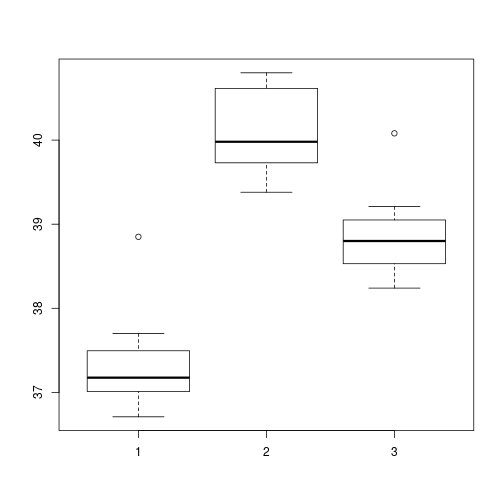

```r
qqnorm(A) # does not look normal 
```

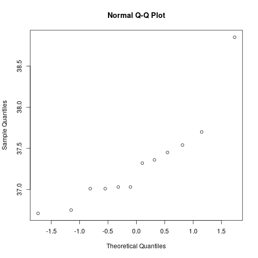

```r
qqnorm(B) # does not look normal
```

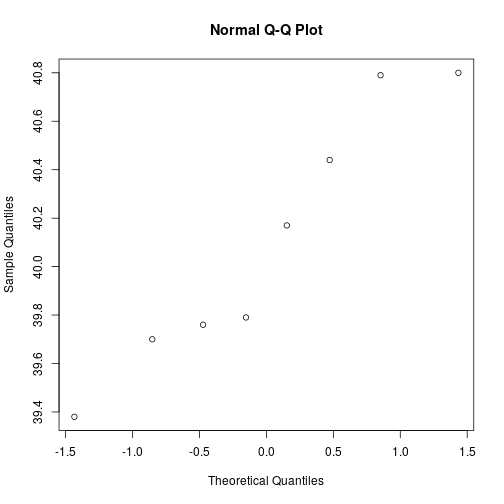

```r
qqnorm(C) # looks a little normal
```

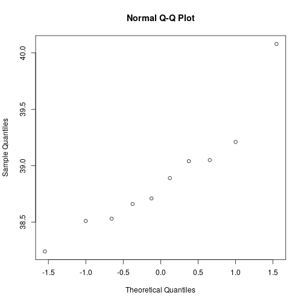
By observing the QQ-plots we can say that normality doesn't look especially straight for any 
sample . It would be best to get more data. 


```r
sd_a <- sd(A)
sd_b <- sd(B)
sd_c <- sd(C)

sd_a
```

```
## [1] 0.5727975
```

```r
sd_b
```

```
## [1] 0.5313846
```

```r
sd_c
```

```
## [1] 0.510812
```

```r
sd_a/sd_c
```

```
## [1] 1.121347
```

```r
#homoscedacity not normal
```
By observing the boxplot and seeing the ratio we see that all the standard deviations are similar and the Homoscedacity 
property holds.

## b


```r
n_a <- length(A)
n_b <- length(B)
n_c <- length(C)

mean_a <- mean(A)
mean_b <- mean(B)
mean_c <- mean(C)
mean_g <- mean(c(A,B,C))

SSB <- n_a*(mean_a-mean_g)^2 + 
       n_b*(mean_b-mean_g)^2 + 
       n_c*(mean_c-mean_g)^2
between.df <- 2
between.meansquare <- SSB/2

SSW <- (n_a-1)*var(A)+
       (n_b-1)*var(B)+
       (n_c-1)*var(C)
within.df <- (n_a + n_b + n_c) - 3
within.meansquare <- SSW/within.df

SST <- SSW + SSB

F <- between.meansquare/within.meansquare

1-pf(F,df1=between.df, df2=within.df)
```

```
## [1] 4.008649e-11
```
The small P-value means we have evidence against the null hypothesis. So it appears from that the three types of sites
do not have the same mean salinity.
# 2

## a 

```r
ss <- c(7.2, 7.7, 8.0, 8.1, 8.3, 8.4, 8.4, 8.5, 8.6, 8.7, 9.1, 9.1, 9.1, 9.8, 10.1, 10.3)
st <- c(8.1, 9.2, 10.0, 10.4, 10.6, 10.9, 11.1, 11.9, 12.0, 12.1)
sc <- c(10.7, 11.3, 11.5, 11.6, 11.7, 11.8, 12.0, 12.1, 12.3, 12.6, 12.6, 13.3, 13.8, 13.9)

boxplot(ss, st, sc)
```

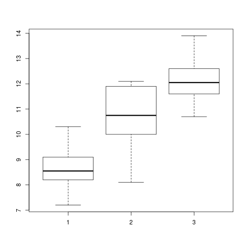

```r
qqnorm(ss)
```

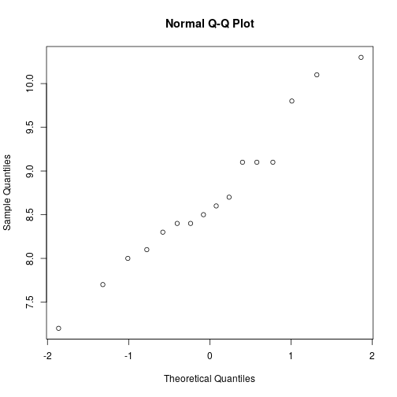

```r
qqnorm(st)
```

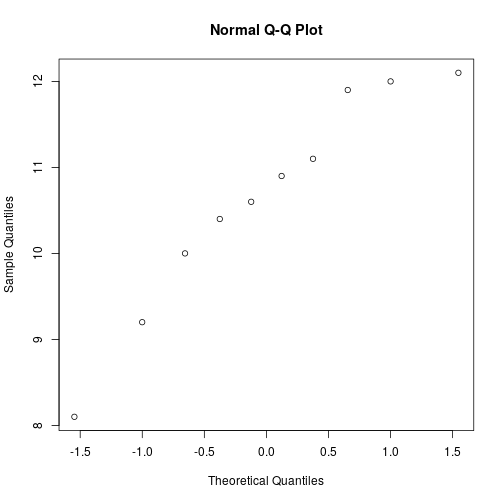

```r
qqnorm(sc)
```

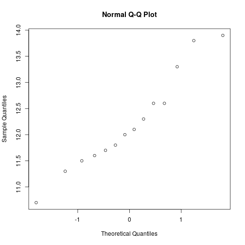

```r
sd_ss <- sd(ss)
sd_st <- sd(st)
sd_sc <- sd(sc)

sd_ss
```

```
## [1] 0.844492
```

```r
sd_st
```

```
## [1] 1.284134
```

```r
sd_sc
```

```
## [1] 0.934327
```

```r
sd_st/sd_ss
```

```
## [1] 1.520599
```
From the boxplot and the ratio of standard deviation, the data looks Homoscedacity. 
Also the data looks normal as observed from the QQ plot. 

## b 


```r
n_ss <- length(ss)
n_st <- length(st)
n_sc <- length(sc)

mean_ss <- mean(ss)
mean_st <- mean(st)
mean_sc <- mean(sc)
mean_g <- mean(c(ss,st,sc))

SSB <- n_ss*(mean_ss-mean_g)^2 + 
       n_st*(mean_st-mean_g)^2 + 
       n_sc*(mean_sc-mean_g)^2
between.df <- 2
between.meansquare <- SSB/2

SSW <- (n_ss-1)*var(ss)+
       (n_st-1)*var(st)+
       (n_sc-1)*var(sc)
within.df <- (n_ss + n_st + n_sc) - 3
within.meansquare <- SSW/within.df

SST <- SSW + SSB

F <- between.meansquare/within.meansquare

1-pf(F,df1=between.df, df2=within.df)
```

```
## [1] 7.824619e-11
```
The small P-value means we have evidence against the null hypothesis. So it appears from that the three types sickle
cell disease doesn't  have the same mean haemoglobin levels.

# 3

## 1


```r
normal <- c(156, 282, 197, 297, 116, 127, 119, 29, 253, 122, 349,110, 143, 64, 26, 86, 122, 455, 655, 14)
alloxan <- c(391, 46, 469, 86, 174, 133, 13, 499, 168, 62, 127, 276, 176, 146, 108, 276, 50, 73)
insulin <- c(82, 100, 98, 150, 243, 68, 228,131, 73, 18, 20, 100, 72, 133, 465, 40, 46, 34, 44)

qqnorm(normal)
```

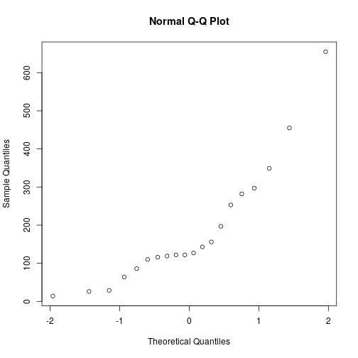

```r
qqnorm(alloxan)
```

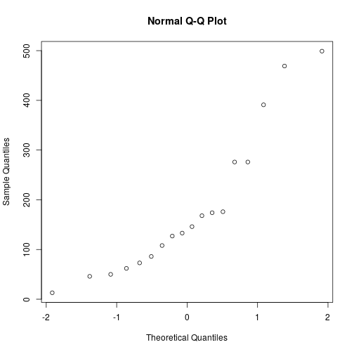

```r
qqnorm(insulin)
```

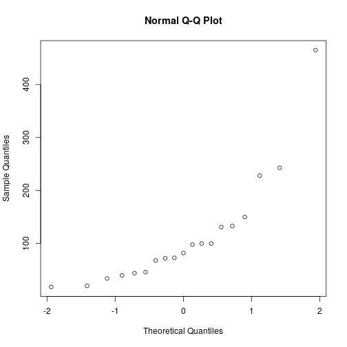

```r
boxplot(normal, alloxan, insulin)
```

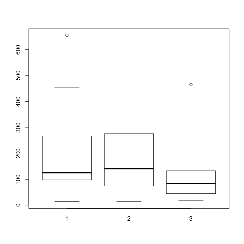

```r
sd(normal)
```

```
## [1] 158.8349
```

```r
sd(alloxan)
```

```
## [1] 144.8493
```

```r
sd(insulin)
```

```
## [1] 105.7896
```

```r
sd(normal)/sd(insulin)
```

```
## [1] 1.501423
```
The data doesn't look normal from the given QQ plot.
From the boxplot and the sd ratio it can be said that the SD are similar. 

## 2


```r
sq.normal <- sqrt(normal)
sq.alloxan <- sqrt(alloxan)
sq.insulin <- sqrt(insulin)

qqnorm(sq.normal)
```

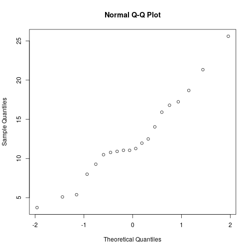

```r
qqnorm(sq.alloxan)
```

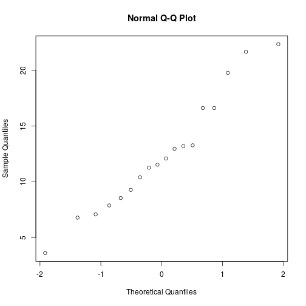

```r
qqnorm(sq.insulin)
```

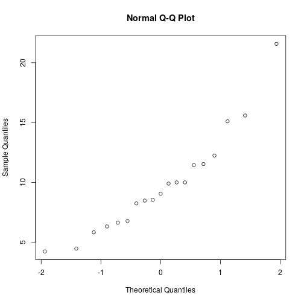

```r
boxplot(sq.normal, sq.alloxan, sq.insulin)
```

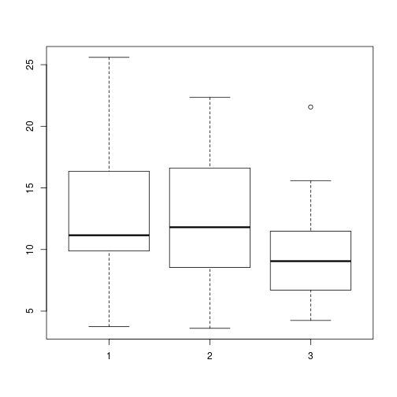

```r
sd(sq.normal)
```

```
## [1] 5.480753
```

```r
sd(sq.alloxan)
```

```
## [1] 5.226939
```

```r
sd(sq.insulin)
```

```
## [1] 4.244474
```

```r
sd(sq.normal)/sd(sq.insulin)
```

```
## [1] 1.291268
```

```r
#looks close to normality and variance ratio is less than 2
```
The transformation did bring the data close to nnormality as seen from the QQ plots of the transformed data.
Also after observing the boxplots and the standard deviation ratio it can be said that the data has similar standard
deviation. 

## 3


```r
n_normal <- length(sq.normal)
n_alloxan <- length(sq.alloxan)
n_insulin <- length(sq.insulin)

mean_normal <- mean(sq.normal)
mean_alloxan <- mean(sq.alloxan)
mean_insulin <- mean(sq.insulin)
mean_g <- mean(c(sq.normal,sq.alloxan,sq.insulin))

SSB <- n_normal*(mean_normal-mean_g)^2 + 
       n_alloxan*(mean_alloxan-mean_g)^2 + 
       n_insulin*(mean_insulin-mean_g)^2
between.df <- 2
between.meansquare <- SSB/2

SSW <- (n_normal-1)*var(sq.normal)+
       (n_alloxan-1)*var(sq.alloxan)+
       (n_insulin-1)*var(sq.insulin)
within.df <- (n_normal + n_alloxan + n_insulin) - 3
within.meansquare <- SSW/within.df

SST <- SSW + SSB

F <- between.meansquare/within.meansquare

1-pf(F,df1=between.df, df2=within.df)
```

```
## [1] 0.1622134
```
The P-value is greater than the alpha value. We thus fail to reject the null hypothesis.

## 4

* H0: normal mean = alloxan mean
* H1: the means of normal and alloxan mice are not equal

```r
t.test(sq.normal, sq.alloxan)
```

```
## 
## 	Welch Two Sample t-test
## 
## data:  sq.normal and sq.alloxan
## t = 0.035226, df = 35.867, p-value = 0.9721
## alternative hypothesis: true difference in means is not equal to 0
## 95 percent confidence interval:
##  -3.463552  3.585979
## sample estimates:
## mean of x mean of y 
##  12.55242  12.49121
```
P-value is more than 0.05/3

* H0: alloxan mean = insulin mean
* H1: the means of insulin and alloxan mice are not equal

```r
t.test(sq.alloxan, sq.insulin)
```

```
## 
## 	Welch Two Sample t-test
## 
## data:  sq.alloxan and sq.insulin
## t = 1.7207, df = 32.789, p-value = 0.09474
## alternative hypothesis: true difference in means is not equal to 0
## 95 percent confidence interval:
##  -0.4936299  5.8977548
## sample estimates:
## mean of x mean of y 
## 12.491208  9.789145
```
P-value is more than 0.05/3

* H0: normal mean = insulin mean
* H1: the means of normal and insulin mice are not equal

```r
t.test(sq.normal, sq.insulin)
```

```
## 
## 	Welch Two Sample t-test
## 
## data:  sq.normal and sq.insulin
## t = 1.7653, df = 35.59, p-value = 0.08608
## alternative hypothesis: true difference in means is not equal to 0
## 95 percent confidence interval:
##  -0.4125421  5.9390938
## sample estimates:
## mean of x mean of y 
## 12.552421  9.789145
```
P-value is more than 0.05/3

