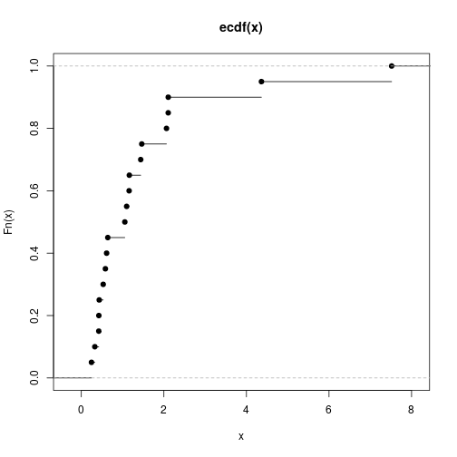
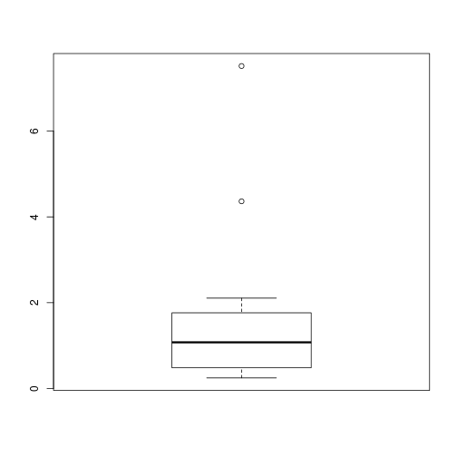
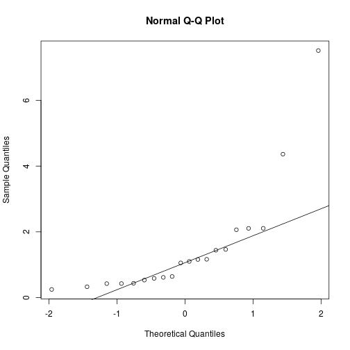
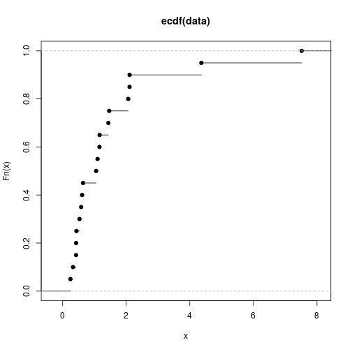

# 1


```r
x <- scan("http://pages.iu.edu/~mtrosset/StatInfeR/Data/sample771.dat")
```

### a)

```r
x_ecdf <- ecdf(x)
plot(x_ecdf)
```



### b)


```r
x_mean <- mean(x)
x_var <- var(x)
x_mean
```

```
## [1] 1.4876
```

```r
x_var
```

```
## [1] 2.934267
```
### c)

```r
x_median <- median(x)
x_median
```

```
## [1] 462
```

```r
IQR <- IQR(x)
#also can be done as
IQR_1 <- quantile(x, 0.75) - quantile(x, 0.25)
```

### d)

```r
x_IQR_to_sd <- IQR/sqrt(x_var)
x_IQR_to_sd
```

```
## [1] 252.7773
```
### e)

```r
boxplot(x)
```



### f)


```r
qqnorm(x)
qqline(x)
```



### g)

```r
kernel_density <- density(x)
plot(kernel_density)
```


### h)


```r
x_IQR_to_sd
```

```
## [1] 0.6466837
```

Here the ratio is more than 1.34. So it looks like the distribution is not a normal distribution.


# 2


```r
baseball_dat_AL <- c(93, 87, 81, 80, 78, 95, 83, 81, 76, 74, 88, 86, 85, 76, 68)
baseball_dat_NL <- c(90, 83, 71, 67, 63, 100, 98, 97, 68, 64, 92, 84, 79, 74, 68)
```
### a)

```r
final <- cbind(baseball_dat_AL, baseball_dat_NL)

boxplot(final)
```


```r
hist(final)
```


### b)

```r
par(mfrow=c(1,2))
hist(baseball_dat_AL)
hist(baseball_dat_NL)
```


```r
median(baseball_dat_AL)
```

```
## [1] 81
```

```r
median(baseball_dat_NL)
```

```
## [1] 79
```

From the histograms it can be seen that the National league data has a bimodal distribution and american league has a unimodal distribution.


```r
par(mfrow=c(1,2))
qqnorm(baseball_dat_AL, main='american league')
qqline(baseball_dat_AL)

qqnorm(baseball_dat_NL, main='national league')
qqline(baseball_dat_NL)
```


The QQ plots of both the data is shown above. American league data looks quite close to a normal distribution. All it's points lie close to a straight line.
The National League data has more variance than American League data.


```r
iqr_to_sd <- IQR(baseball_dat_AL)/sqrt(var(baseball_dat_AL))
iqr_to_sd
```

```
## [1] 1.314767
```

The ratio is quite close to 1.34. So as mentioned above the American League data is quite close to a normal distribution.

# 3

### a)

```r
data <- scan("http://pages.iu.edu/~mtrosset/StatInfeR/Data/sample774.dat")
data_ecdf <- ecdf(data)
plot(data_ecdf)
```



### b)

```r
data_mean <- mean(data)
data_var <- var(data)
data_median <- median(data)
IQR <- IQR(data)
```

### c)

```r
sqrt_var <- sqrt(data_var)
sqrt_var
```

```
## [1] 1.71297
```

```r
IQR
```

```
## [1] 1.10775
```

```r
IQR/sqrt_var
```

```
## [1] 0.6466837
```

The ratio between IQR and square root of variance(standard deviation) by definition must be close to 1.34. The ratio is very less than this number. Thus this distribution is not sampled from a normal distribution.

### d)

```r
qqnorm(data)
qqline(data)
```


As seen in the Q-Q plot the data doesn't look like it's taken from a normally distributed data population. The data doesn't lie on a straight line on the QQ plot.


### e)

```r
data_y <- log(data)

IQR(data_y)/sqrt(var(data_y))
```

```
## [1] 1.308589
```

```r
par(mfrow=c(1,3))
hist(data_y)
plot(data_y)
qqnorm(data_y)
qqline(data_y)
```


You can see  from the given Q-Q plot that the points almost lie along a straight line. Also the IQR to SD ratio is quite close to 1.34. Thus, this distribution is a distribution very close to normal distribution.

# 4 

### a)

```r
data_5 <- scan("http://pages.iu.edu/~mtrosset/StatInfeR/Data/test351.dat")

par(mfrow=c(1,2))
qqnorm(data_5)
qqline(data_5)
hist(data_5)
```


```r
IQR(data_5)/sqrt(var(data_5))
```

```
## [1] 1.491889
```

```r
boxplot(data_5)
```


Here, it can be seen that the IQR to SD value is significantly more than 1.34. It looks like the distribution is not normally distributed.
