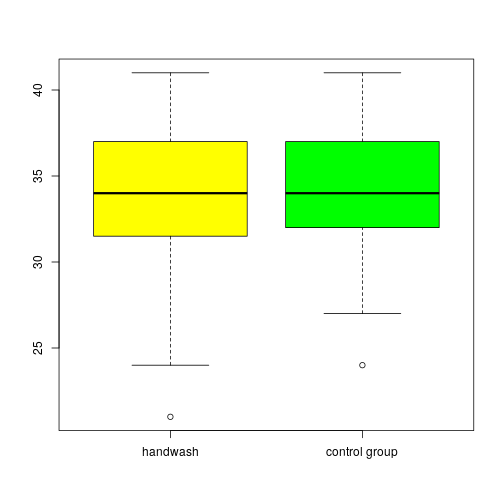

# 1

## a
In the given case, the students are the experimental units.

Each experimental unit is asked to provide a rating for each of the questions.

There are 132 independat samples.

## b


```r
k <- read.csv('handwashing.txt', sep=' ')
```

### Hypotheses for the given problem

* Delta = Mu(wash$Trolley) - Mu(controlgroupTrolley)
    + H0 : Delta => 0
    + H1 : Delta < 0


```r
handwash <- k[k$Condition==1,]
controlGroup <- k[k$Condition == 0,]

mean.handwash.Trolley <- mean(handwash$Trolley)
mean.control.Trolley <- mean(controlGroup$Trolley)

delta <- mean.handwash.Trolley - mean.control.Trolley
se <- sqrt(var(handwash$Trolley)/63 + var(controlGroup$Trolley)/69)
welch_stat <- delta/se

degree_f <- ((var(handwash$Trolley)/63+var(controlGroup$Trolley)/69)^2)/
((var(handwash$Trolley)/63)^2/62+(var(controlGroup$Trolley)/69)^2/68)

P_val <- pt(welch_stat, df=degree_f)
P_val
```

```
## [1] 0.7181691
```

The P-value is 0.7181691. This means the data gives strong evidence that handwashing will not lower the 
average answer to the trolley question

Fail to reject the null hypotheses

## c


```r
k$Total <- rowSums(k[2:7])

#----------------------------------------------
handwash <- k[k$Condition==1,]
controlGroup <- k[k$Condition == 0,]
#----------------------------------------------

k.temp <- cbind(k, k$Total)

boxplot(k[k$Condition==1,]$Total, k[k$Condition == 0,]$Total, 
col=c("yellow", "green"), names=c("handwash" , "control group"))
```



## d

* Delta = Mu(handwash$Total) - Mu(controlGroup$Total)
    + H0 : Delta >= 0
    + H1 : Delta < 0


```r
mean.handwash.Total <- mean(handwash$Total)
mean.control.Total <- mean(controlGroup$Total)

var.handwash.Total <- var(handwash$Total)
var.controlgroup.Total <- var(controlGroup$Total)

delta <- mean.handwash.Total - mean.control.Total
se <- sqrt(var.handwash.Total/63 + var.controlgroup.Total/69)
T.Welch <- delta/se

degree_f <- ((var.handwash.Total/63+var.controlgroup.Total/69)^2)/(((var.handwash.Total)/
63)^2/62+((var.controlgroup.Total)/69)^2/68)

P_val <- pt(T.Welch, df=degree_f)
P_val
```

```
## [1] 0.3999633
```

The P-value is 0.3999633. This means the data gives strong evidence that hand washing will not lower the 
average total score.

The P-value is too large. Failed to reject the null hypotheses.

## e


```r
#washed hands 95% confidence interval
ci.handwash_neg <- mean.handwash.Total - qnorm(0.975)*sd(handwash$Total)/sqrt(63)
ci.handwash_neg
```

```
## [1] 32.62845
```

```r
ci.handwash_pos <- mean.handwash.Total + qnorm(0.975)*sd(handwash$Total)/sqrt(63)
ci.handwash_pos
```

```
## [1] 34.70488
```

```r
#control group 95% confidence interval
ci.controlgroup_neg <- mean.control.Total - qnorm(0.975)*sd(controlGroup$Total)/sqrt(69)
ci.controlgroup_neg
```

```
## [1] 32.99021
```

```r
ci.controlgroup_pos <- mean.control.Total + qnorm(0.975)*sd(controlGroup$Total)/sqrt(69)
ci.controlgroup_pos
```

```
## [1] 34.69095
```

```r
q <- qt(0.975, df=degree_f)
lower <- delta - q*se
lower
```

```
## [1] -1.529301
```

```r
upper <- delta + q*se
upper
```

```
## [1] 1.181474
```

* Confidence intervals for handwashed group
    + lower = 32.62845
    + upper =  34.704

* Confidence intervals for control group
    + lower = 32.99021
    + upper = 34.69

* Confidence intervals for the difference in the two means
    + lower = -1.52931
    + upper = 1.18147

# f
I feel that the test done in part(d) is better. Here total is the sum of all the given scores.
So it gives an estimate of all the score given by a particular experimental unit.Thus is gives a more
holistic picture of the data. 

# 2

## a


```r
NBA_heights <- c(80,82,82,77,74,81,83,80,76,82,81,81)
NFL_heights <- c(71,71,74,73,76,74,79,75,70,77,77,68)
ci.NBA_neg <- mean(NBA_heights) - qt(0.975, df=11)*sd(NBA_heights)/sqrt(12)
ci.NBA_neg
```

```
## [1] 78.15133
```

```r
ci.NBA_pos <- mean(NBA_heights) + qt(0.975, df=11)*sd(NBA_heights)/sqrt(12)
ci.NBA_pos
```

```
## [1] 81.682
```

```r
#control group 95% confidence interval
ci.NFL_neg <- mean(NFL_heights) - qt(0.975, df=11)*sd(NFL_heights)/sqrt(12)
ci.NFL_neg
```

```
## [1] 71.6668
```

```r
ci.NFL_pos <- mean(NFL_heights) + qt(0.975, df=11)*sd(NFL_heights)/sqrt(12)
ci.NFL_pos
```

```
## [1] 75.8332
```
* Confidence intervals for NBA group
    + lower = 78.15133
    + upper = 81.682

* Confidence intervals for NFL group
    + lower = 71.66
    + upper = 75.8332

## b


```r
1 - 2*pbinom(0:5, 12, 0.5)
```

```
## [1] 0.9995117 0.9936523 0.9614258 0.8540039 0.6123047 0.2255859
```

```r
k <- 2
n <- 12
```

Thus we'll take the 3rd smallest and the 3rd largest elements to be our confidence intervals. (k+1) and
(N-k) position elements on the soreted array of both the categories


```r
mean_NBA <- mean(NBA_heights)
mean_NFL <- mean(NFL_heights)

var_NBA <- var(NBA_heights)
var_NFL <- var(NFL_heights)

delta <- mean_NBA - mean_NFL
se <- sqrt(var_NBA/12 + var_NFL/12)
T.Welch <- delta/se
degree_f <- ((var_NBA/12+var_NFL/12)^2)/(((var_NBA)/12)^2/11+((var_NFL)/12)^2/11)
sort_NBA <- sort(NBA_heights)
sort_NFL <- sort(NFL_heights)

ci_NBA_med <- sort_NBA[c(k+1, n-k)]
ci_NFL_med <- sort_NFL[c(k+1, n-k)]
ci_NBA_med
```

```
## [1] 77 82
```

```r
ci_NFL_med
```

```
## [1] 71 77
```

## c

* Delta = Mu(NBA.heights) - Mu(NFL.heights)
    + H0 : Delta != 0
    + H1 : Delta == 0


```r
mean_NBA <- mean(NBA_heights)
mean_NFL <- mean(NFL_heights)

var_NBA <- var(NBA_heights)
var_NFL <- var(NFL_heights)

delta <- mean_NBA - mean_NFL
se <- sqrt(var_NBA/12 + var_NFL/12)
T.Welch <- delta/se
degree_f <- ((var_NBA/12+var_NFL/12)^2)/(((var_NBA)/12)^2/11+((var_NFL)/12)^2/11)
P_val <- 2*(1 - pt(T.Welch, df=degree_f))
P_val
```

```
## [1] 6.082016e-05
```
The P-value is 6.082016e-05. This means the data gives strong evidence that NBA and NFL players have the same average heights

reject the null hypotheses
