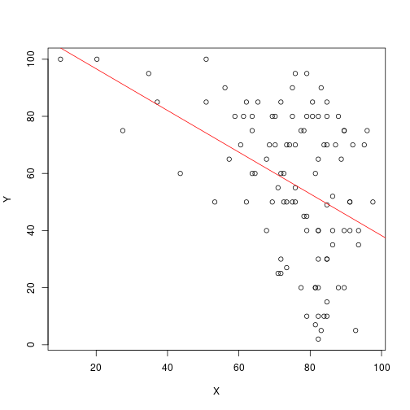

# 1

- H0 : number of misprints follow poisson
- H1 : number of misprints do not follow poisson


```r
num_mis_print <- c(0:10)
news_pages <- c(9, 23, 40, 30, 31, 26, 19, 10, 5, 4, 3)

mis_print_total <- sum(num_mis_print*news_pages)
news_pages_total <- sum(news_pages)
ave <- mis_print_total/news_pages_total

cats <- news_pages_total*dpois(0:20, ave)
data.frame(0:20, expected=round(cats, 1))
```

```
##    X0.20 expected
## 1      0      5.0
## 2      1     18.5
## 3      2     34.1
## 4      3     41.9
## 5      4     38.6
## 6      5     28.4
## 7      6     17.5
## 8      7      9.2
## 9      8      4.2
## 10     9      1.7
## 11    10      0.6
## 12    11      0.2
## 13    12      0.1
## 14    13      0.0
## 15    14      0.0
## 16    15      0.0
## 17    16      0.0
## 18    17      0.0
## 19    18      0.0
## 20    19      0.0
## 21    20      0.0
```

```r
expected <- rep(0, 9)
expected[1:8] <- news_pages_total*dpois(0:7, ave)
expected[9] <- news_pages_total*(1 - ppois(7, ave))
observed <- c(9, 23, 40, 30, 31, 26, 19, 10, 12)

statsL <- 2*sum(observed*log(observed/expected))
statsL
```

```
## [1] 13.34654
```

```r
1 - pchisq(statsL, df=7)
```

```
## [1] 0.06410186
```

```r
statsX  <- sum((observed-expected)^2/expected)
statsX
```

```
## [1] 14.29164
```

```r
1 - pchisq(statsX, df=7)
```

```
## [1] 0.04623075
```

If we consider the log likelihood, the calculated probability is more than
the alpha value. Thus, we fail to reject the null hypothesis. The data is consistent 
with the null hypothesis and the number of misprtints do follow a poisson distribution.


If we consider the other test, the calculated probability is less than
the alpha value. Thus, we  reject the null hypothesis. The data is not consistent 
with the null hypothesis and the number of misprtints don't follow a poisson distribution.

# 2

## a


```r
exam <- read.table('examanxiety.txt', header=TRUE)

X <- exam$Anxiety
Y <- exam$Exam

corelation <- cor(X,Y)
sy <- sd(Y)
sx <- sd(X)

b <- corelation*(sy/sx)
a <- mean(Y) - b*mean(X)

pred_Y <- a + b*(X)
pred_Y
```

```
##   [1]  48.24295  46.47770  60.01129  66.48387  45.88929  67.07229  51.77345
##   [8]  55.89237  60.59970  51.18504  53.53870  52.36187  60.01129  56.48079
##  [15]  85.90162  41.77037  55.89237  53.53870  44.71245  64.13020  52.36187
##  [22]  54.71554  63.54179  70.27719  58.83445  51.77345  64.71862  91.19737
##  [29]  57.65762  45.88929  45.88929  56.48079  79.42904  51.18504  53.53870
##  [36]  53.53870  84.13637  51.77345  50.59662  74.13329  51.18504  54.12712
##  [43]  58.24604  57.06920  55.89237  59.42287  40.00512  61.77654  56.48079
##  [50]  57.65762  42.94720  68.24912  72.36804  49.41979  45.88929  58.83445
##  [57]  51.18504  60.59970  65.89545  61.18812  42.94720  49.41979  51.18504
##  [64]  51.77345  51.18504  44.71245  44.12404  48.24295  58.24604  64.71862
##  [71]  64.71862  58.83445  69.42595  49.41979  49.41979  54.71554  51.18504
##  [78] 103.94397  74.13329  47.06612  50.00820  49.41979  96.49312  47.65454
##  [85]  50.00820  61.77654  41.18195  65.89545  49.41979  43.53562  49.41979
##  [92]  50.59662  57.65762  47.06612  58.83445  48.24295  49.41979  55.89237
##  [99]  59.42287  54.12712  51.18504  53.53870  44.71245
```

```r
plot(X,Y)
abline(a,b, col='red')
```



## b

We assumed that the given varialbles have a linear relationship.
We want to predict the exam score according to the anxiety. 

- The Slope is basically the value of increase in exam score for unit increase in anxiety.
- Here the the exam score decreases by around -0.73 for unit increase in anxiety.
- On the other hand the 'a' value is the exam score if the particular candidate has 
zero anxiety. 
- Here the intercept value is around 111.244. The exam score is out of 100 not 111, but I don't think there's anyone who will have zero anxiety!!
